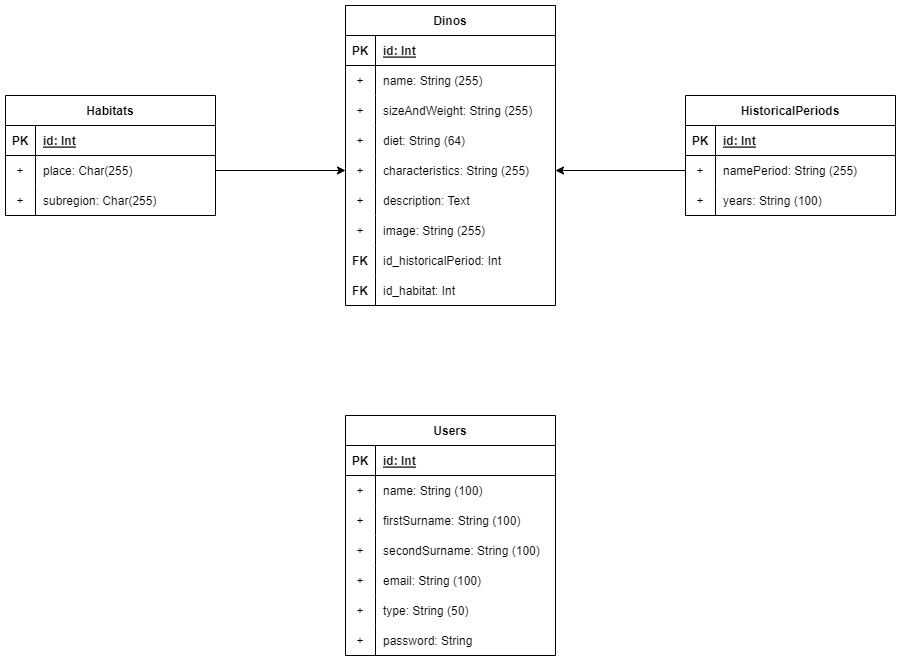
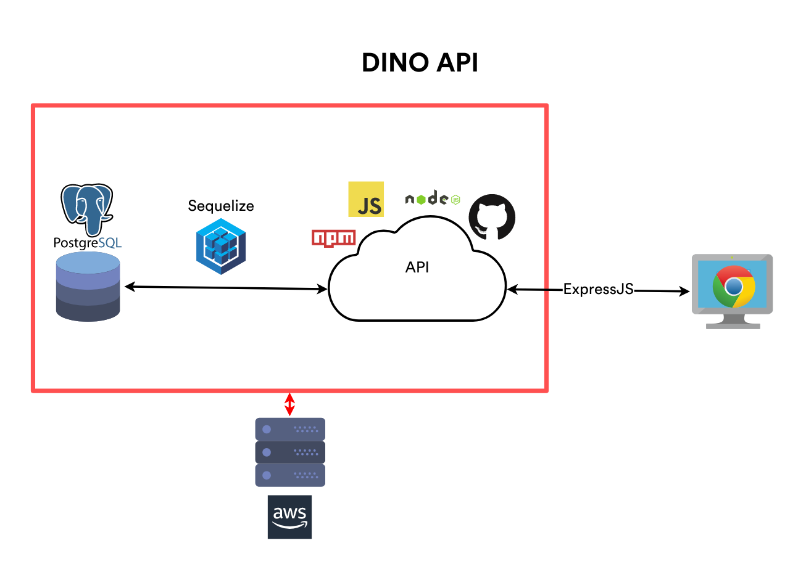

# DinoAPI

## ¡Bienvenido a la DinoAPI!

En esta página encontrarás las instrucciones para utilizar la API.

### Users

#### Para loggin

https://dinoapi.onrender.com/auth/login

#### Para signup

https://dinoapi.onrender.com/auth/signup

### Dinos

#### Para crear un dino

https://dinoapi.onrender.com/dinos/

#### Ver el listado completo de dinosaurios

**_Con esta URL llamas a todo el listado de dinosaurios disponibles:_**

https://dinoapi.onrender.com/dinos/

#### Mostrar un dinosaurio aleatorio

**_Para mostrar la información de un dinosaurio al azar, solo debes utilizar la siguiente URL:_**

https://dinoapi.onrender.com/dinos/aleatorio/

#### Buscar dinosaurios por nombre

**_Con esta función puedes buscar dinosaurios escribiendo unas cuantas letras para encontrar coincidencias:_**

https://dinoapi.onrender.com/dinos/letras/NOMBRE_A_BUSCAR

#### Buscar dinosaurios por nombre exacto

**_Si ya sabes exactamente cuál es el nombre del dinosario, puedes buscarlo de esta forma:_**

https://dinoapi.onrender.com/dinos/nombre/NOMBRE_A_BUSCAR

#### Buscar dinosaurios por id

**_Supongamos que quieres encontrar un dinosaurio por la id, solo debes ingresar_**

https://dinoapi.onrender.com/dinos/id/ID

#### Para actualizar un dinosaurio

https://dinoapi.onrender.com/dinos/:id

#### Para eliminar un dinosario

https://dinoapi.onrender.com/dinos/:id

### Habitats

#### Para crear un nuevo habitat

https://dinoapi.onrender.com/habitats

#### Para obtener todos los habitats

https://dinoapi.onrender.com/habitats

#### Para obtener un habitat aleatoriamente

https://dinoapi.onrender.com/habitats/random

#### Para obtener un habitat por place

https://dinoapi.onrender.com/habitats/place/:place

#### Obtener un habitat por cualquier letra

https://dinoapi.onrender.com/habitats/id/:letter

#### Obtener un habitat por id

https://dinoapi.onrender.com/habitats/id/:id

#### Para actualizar un habitat

https://dinoapi.onrender.com/habitats/:id

#### Para eliminar un habitat

https://dinoapi.onrender.com/habitats/:id

### HistoricalPeriods (Períodos históricos)

#### Para crear un HistoricalPeriod

https://dinoapi.onrender.com/historicalperiods

#### Para obtener todos los HistoricalPeriods

https://dinoapi.onrender.com/historicalperiods

#### Para obtener un historicalPeriod aleatorio

https://dinoapi.onrender.com/historicalperiods/random

#### Para obtener un historicalPeriod por nombre

https://dinoapi.onrender.com/historicalperiods/name/:name

#### Para obtener un historicalPeriod por cualquier letra

https://dinoapi.onrender.com/historicalperiods/letters/:letters

#### Obtener un historicalPeriod por ID}

https://dinoapi.onrender.com/historicalperiods/id/:id

#### Para actualizar un historicalPeriod

https://dinoapi.onrender.com/historicalperiods/:id

#### Para eliminar un historicalPeriod

https://dinoapi.onrender.com/historicalperiods/:id

_La DinoAPI se encuentra en crecimiento, así que por el momento solamente puedes encontrar 69 dinosaurios._

## Objetivo general

- Desarrollar una API que permita mostrar información de Dinosaurios, hábitat y periodo histórico al que pertenecieron a través de diferentes formas de búsquedas.

## Requerimientos del proyecto

- Para la aplicación se contará con 2 tipos de usuarios:
  - Admin: Puede hacer cualquier operación sobre los registros.
  - Usuario: Solamente puede realizar las consultas de búsqueda, crear una cuenta y autenticarse.
- Para poder hacer una búsqueda se necesita estar registrado, así como autenticado.
- Solo los usuarios de tipo administrador podrán crear nuevos registros.
- Solo los usuarios de tipo administrador podrán actualizar registros.
- Solo los usuarios de tipo administrador podrán eliminar registros.

## Desarrollo

### Modelo relacional

DinoAPI como su nombre lo indica es una API que permite consultar información de dinosaurios, así como de su hábitat o al periodo histórico al que pertenecieron.
El proyecto se basa en la siguiente imagen del modelo relacional, en donde se puede observar que consiste en 4 tablas. En donde la tabla “Dinos” pertenece a la tabla “Habitats” así como también pertenece a la tabla “HistoricalPeriods”. También se cuenta con una tabla llamada “Users” que permitirá guardar la información de los usuarios.

### Tecnologías utilizadas

Como se muestra en la siguiente imagen se presentan las diferentes tecnologías que se utilizaron en el proyecto. El rectángulo indica la aplicación backend, dentro del backend se encuentra una base de datos PostgreSQL y una API desarrollada en JavaScript con node, npm y GitHub como gestor de versiones que se comunica con la base de datos mediante Sequelize. Todo el backend está hosteado en AWS y se comunica con un cliente a través de Express.js en un navegador.

